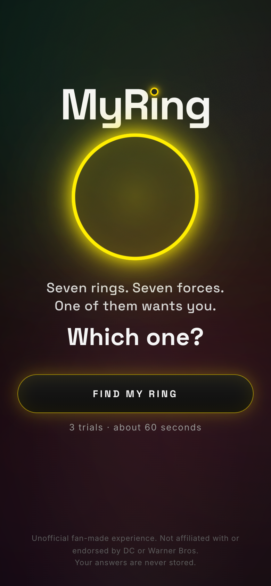
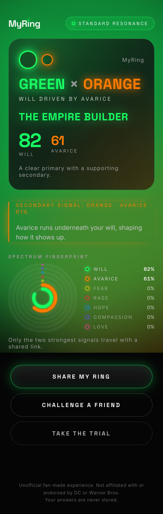
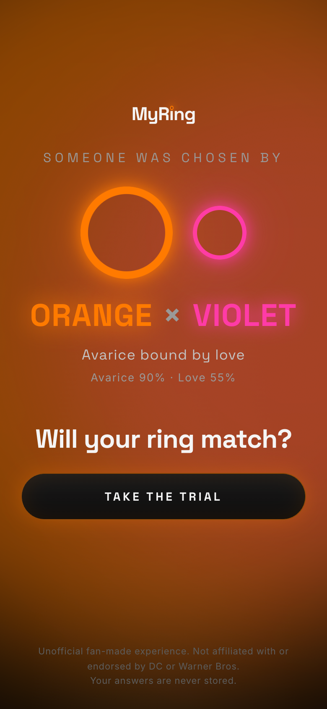

# MyRing

Which ring would choose you? A three-trial personality game built around the seven emotional forces of the spectrum. Mobile-first, fast, and a little dramatic. Runs entirely in the browser, with no backend and no AI calls.

Live: https://tojen.github.io/myring/

Unofficial fan-made experience. Not affiliated with or endorsed by DC or Warner Bros.

## Screenshots

| Homepage | Result | Challenge from a friend |
| --- | --- | --- |
|  |  |  |

## How it works

1. **Detection.** Seven rings appear.
2. **Trial I.** One scenario, five choices. Two rings lose interest.
3. **Trial II.** A harder scenario with one choice per remaining ring. Two more rings drop.
4. **Trial III.** The final signal. Three choices. One ring chooses you.
5. **Result.** Primary ring, secondary ring, archetype, the choices that got you there, and a spectrum fingerprint you can share or send as a challenge.

Nothing is stored or sent anywhere. Result links only carry the ring names, scores, and archetype.

## How scoring works

Everything lives in `src/lib/engine.ts`.

- Every option carries a seven-number weight vector, one weight per ring, in the order green, yellow, red, orange, blue, indigo, violet.
- Choices add their weights to a running tally. After Trials I and II the two lowest-scoring remaining rings are eliminated. Ties break on a rotation derived from your choices, so repeat plays do not always favour the same ring.
- Trials II and III have one option per ring. Only options whose dominant ring is still in play are shown, so you see five options, then three.
- The final tally becomes a percentage spectrum. The primary ring lands between 76 and 97 depending on its lead over the runner-up. The remaining rings scale from it.
- The primary and secondary ring together pick one of 42 archetypes. The classification (perfect resonance, dual spectrum, pure signal, and so on) is computed in `src/lib/classify.ts`.

To add scenarios, append to the `OPENERS`, `SECOND`, or `FINAL` arrays. Openers should spread weight across all seven rings. Second and final trials need exactly one option per ring with a clear dominant weight.

## Local development

```bash
npm install
npm run dev     # http://localhost:5173/myring/
```

## Sharing and social previews

Every result and challenge link has its own preview card. Link crawlers ignore URL fragments and do not run JavaScript, so hash routes alone would all preview identically. Instead, `scripts/og.ts` generates at build time:

- `public/og/default.png` plus one 1200x630 card per primary/secondary pair for results (`og/r-<primary>-<secondary>.png`) and challenges (`og/c-<primary>-<secondary>.png`).
- A tiny static page per pair at `public/s/<primary>/<secondary>/` (result) and `public/c/<primary>/<secondary>/` (challenge) carrying Open Graph and Twitter tags, which immediately forwards to the matching hash route.

Share links point at these static pages. `npm run og` regenerates everything and runs automatically as part of `npm run build`. The generated folders are gitignored. Cards render with `@resvg/resvg-js` using the Space Grotesk fonts committed in `scripts/fonts/`.

## Deploying

Pushes to `main` build and deploy to GitHub Pages through `.github/workflows/deploy.yml`. No secrets or repository variables are required.

## Scripts

| Command | What it does |
| --- | --- |
| `npm run dev` | Dev server |
| `npm run og` | Regenerate social cards and share pages into `public/` |
| `npm run build` | Generate cards, typecheck, and build to `dist/` |
| `npm run preview` | Serve the production build locally |
| `npm run lint` | oxlint |
